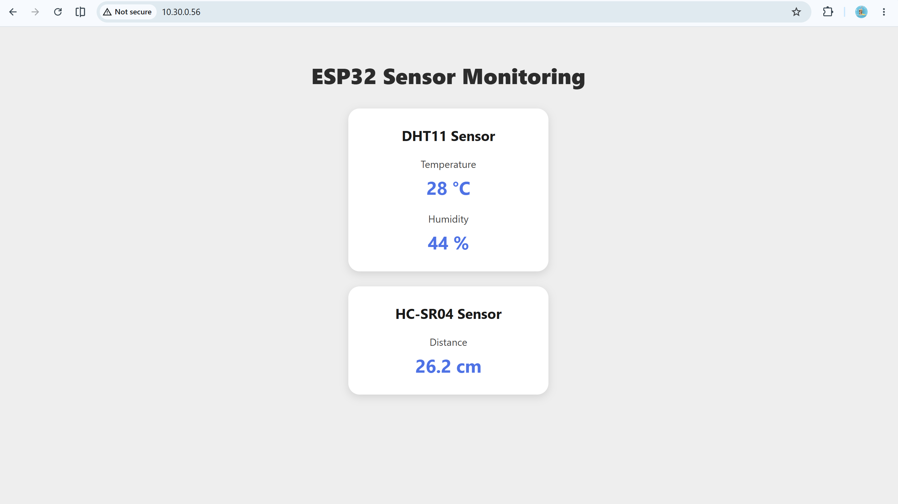
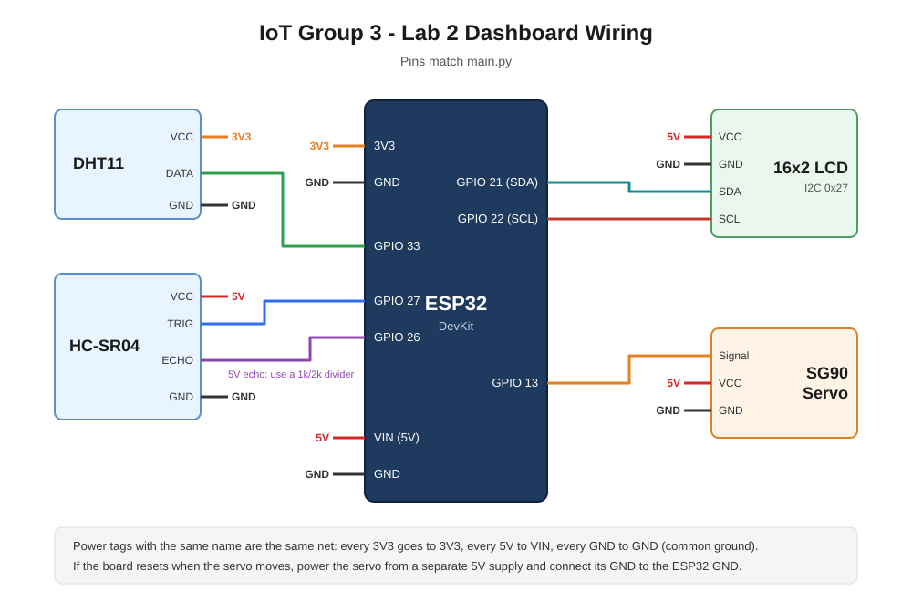

# IoT Group 3 — Lab 2: Web Server Control

MicroPython on an ESP32, one lab in five steps. The board joins the local Wi-Fi network, runs a small HTTP server on port 80, and serves a web page that a phone or laptop on the same network can open. Each task adds one more thing that page can do, and the last one combines them all.

| Task | What it adds | Direction |
|:--|:--|:--|
| [Task 1](#task-1--sensor-monitoring) | Temperature, humidity and distance on a self-refreshing web page | Board → browser |
| [Task 2](#task-2--sensor-data-to-lcd) | Two toggle buttons that push sensor values onto a 16x2 LCD | Browser → board |
| [Task 3](#task-3--web-controlled-servo) | A 0–180° slider that drives an SG90 servo | Browser → board |
| [Task 4](#task-4--custom-text-to-lcd) | A textbox that sends any message to the LCD, scrolling if too long | Browser → board |
| [Task 5](#task-5--complete-iot-web-dashboard) | All of the above in one ESP32 program and one web page | Both |

Tasks 1 and 2 build on each other — Task 2 is Task 1 plus the LCD and the buttons. Tasks 3 and 4 are standalone scripts. Task 5 merges all four into a single program.

---

## Before you run anything

**Board:** ESP32 with MicroPython firmware flashed.

**Files.**

| File | Task |
|:--|:--|
| [`individual_tasks/Lab2_Task1.py`](individual_tasks/Lab2_Task1.py) | Task 1 |
| [`individual_tasks/Lab2_Task2.py`](individual_tasks/Lab2_Task2.py) | Task 2 |
| [`individual_tasks/Lab2_Task3.py`](individual_tasks/Lab2_Task3.py) | Task 3 |
| [`individual_tasks/Lab2_Task4.py`](individual_tasks/Lab2_Task4.py) | Task 4 |
| [`main.py`](main.py) | Task 5 |
| [`docs/wiring_diagram.svg`](docs/wiring_diagram.svg) | Wiring diagram for Task 5 |

**Library files.** Tasks 2, 4 and 5 do `from machine_i2c_lcd import I2cLcd`. That module — and the `lcd_api.py` it depends on — is **not in this repository**; it is the driver handed out with the lab. Upload both files to the ESP32 (Thonny: *File → Save as → MicroPython device*) before running those tasks, or the import fails immediately.

**Wi-Fi credentials.** Every script starts with:

```python
ssid = " "
password = " "
```

These are blanked on purpose. Fill in your own network name and password before running. The board and the computer you browse from must be on the **same network**.

**Running a task.** Open the file in Thonny and press Run. The shell prints the address the server is listening on:

```
Wi-Fi connected!
ESP32 IP address: 192.168.1.42
Open this address in your browser:
http://192.168.1.42
```

Type that address into a browser. Run only one task at a time — they all bind to port 80.

---

## Task 1 — Sensor Monitoring

**Goal:** read the DHT11 and the HC-SR04, show all three values on a web page, refresh every 1–2 seconds.

### Wiring

| Component | Signal | ESP32 pin |
|:--|:--|:--|
| DHT11 | DATA | GPIO 33 |
| HC-SR04 | TRIG | GPIO 27 |
| HC-SR04 | ECHO | GPIO 26 |

Both sensors take VCC and GND from the board. Note that the HC-SR04 is a 5 V part and its ECHO line idles at 5 V, while ESP32 GPIOs are 3.3 V — if your board has no protection on that pin, a voltage divider on ECHO is the safe way to wire it.

### How it works

`read_distance()` runs the standard ultrasonic handshake: hold TRIG low for 2 µs to settle, pulse it high for 10 µs, then time how long ECHO stays high with `time_pulse_us(echo, 1, 30000)`. The 30 ms ceiling is the timeout — if nothing echoes back, the call returns a negative number and the function returns `None`, which the page renders as "Out of range". The conversion is the usual one, distance = (duration × 0.0343) / 2, where 0.0343 cm/µs is the speed of sound and the halving accounts for the round trip:

```python
duration = time_pulse_us(echo, 1, 30000)

if duration < 0:
    return None

distance = (duration * 0.0343) / 2
```

`read_dht11()` calls `dht_sensor.measure()` and returns temperature and humidity, or `(None, None)` if the sensor does not answer. Both readers are wrapped in `try`/`except`, so one bad reading prints an error and leaves the server running instead of killing the loop.

`create_webpage()` builds the HTML as one string with `%TEMPERATURE%`, `%HUMIDITY%` and `%DISTANCE%` standing in for the live values, then swaps them out with `.replace()`. The automatic refresh is a single line in the `<head>`:

```html
<meta http-equiv="refresh" content="2">
```

The browser reloads the whole page every 2 seconds, which re-runs the server loop and re-reads the sensors.

The main loop is a plain blocking socket server: `accept()` a browser, `recv()` the request, read both sensors, build the page, send the HTTP headers and body, close the connection. The `finally:` block closes the client socket whatever happens, so a failed request cannot leak one.

### Evidence



---

## Task 2 — Sensor Data to LCD

**Goal:** add two toggle buttons to the page. Show/Hide Distance drives LCD line 1, Show/Hide Temperature drives LCD line 2, and each button's label flips to match its current state.

### Wiring

Task 1's wiring, unchanged, plus the LCD:

| Component | Signal | ESP32 pin |
|:--|:--|:--|
| DHT11 | DATA | GPIO 33 |
| HC-SR04 | TRIG | GPIO 27 |
| HC-SR04 | ECHO | GPIO 26 |
| I2C LCD 16x2 | SDA | GPIO 21 |
| I2C LCD 16x2 | SCL | GPIO 22 |

### Configuration

```python
I2C_ADDR = 0x27

i2c = SoftI2C(sda=Pin(21), scl=Pin(22), freq=400000)
lcd = I2cLcd(i2c, I2C_ADDR, 2, 16)
```

`0x27` is the common address for these I2C backpacks; `0x3F` is the other one you will meet. If the display stays blank or shows only blocks, scan the bus with `i2c.scan()` and use whatever address comes back. The `2, 16` are the row and column counts. On startup the script writes a short "IoT Class / Lab 2 & Task 2" splash, waits 2 seconds, then clears.

### How it works

Two module-level flags hold what is currently on screen:

```python
show_distance = False
show_temperature = False
```

The buttons are links back to the server with a query string, so a click is just another GET the loop can recognise. Each branch flips its flag and either writes the row or blanks it:

```python
if "/?distance=toggle" in request:
    show_distance = not show_distance

    if show_distance:
        display_distance(distance)
    else:
        clear_lcd_row(0)
```

`clear_lcd_row(row)` moves to the start of the row and writes 16 spaces — the LCD has no per-line clear, so overwriting the whole row is how you erase it. Row numbering starts at 0, so LCD "line 1" is row `0` and "line 2" is row `1`.

After the toggle branches, two unconditional checks repaint whichever rows are currently enabled:

```python
if show_distance:
    display_distance(distance)

if show_temperature:
    display_temperature(temperature)
```

That is what keeps the LCD live rather than frozen at the value it held when the button was pressed — every page refresh rewrites it with a fresh reading.

`create_webpage()` takes the two flags as arguments so the button labels can follow the state: the same button reads **Show Distance** when the flag is false and **Hide Distance** when it is true.

### Evidence

Short video showing both buttons toggling between Show and Hide, with the values appearing and disappearing on the LCD.

> **Video:** [Watch on YouTube](https://youtube.com/shorts/2abQ6F4Eitc?feature=share)

---

## Task 3 — Web-Controlled Servo

**Goal:** an SG90 servo on the ESP32, a 0–180° slider on the page, the angle displayed and the servo following it.

### Wiring

| Component | Signal | ESP32 pin |
|:--|:--|:--|
| SG90 servo | Signal (orange/yellow) | GPIO 13 |
| SG90 servo | VCC (red) | 5 V |
| SG90 servo | GND (brown) | GND |

A servo under load draws more current than the USB rail likes. If the board browns out or resets when the servo swings, power the servo from a separate 5 V supply and tie the grounds together.

### Configuration

```python
servo = PWM(Pin(13))
servo.freq(50)

PULSE_MIN_US = 500     # 0 degrees
PULSE_MAX_US = 2500    # 180 degrees
PERIOD_US = 20000      # 50 Hz frame
```

A hobby servo does not read duty cycle as a percentage — it reads the *width of the high pulse* inside each 20 ms frame. Roughly 500 µs means 0°, 2500 µs means 180°. If your servo buzzes at the extremes or never quite reaches them, these two constants are what you adjust.

### How it works

`move_servo(angle)` clamps the angle into 0–180, converts it to a pulse width by linear interpolation, and writes it out:

```python
pulse_us = PULSE_MIN_US + (angle / 180) * (PULSE_MAX_US - PULSE_MIN_US)
```

MicroPython builds disagree about how to set a duty cycle, so the script checks once at startup for what is available — `duty_ns()` (nanoseconds, the direct one), `duty_u16()` (0–65535), or the older `duty()` (0–1023) — and converts the pulse width into whichever unit that build wants. This is why the same file runs on different ESP32 firmware versions without edits.

On the page, the slider fires two different things as you drag it:

```html
<input type="range" min="0" max="180"
       oninput="document.getElementById('angle-value').innerHTML = this.value"
       onchange="fetch('/servo?angle=' + this.value)">
```

`oninput` updates the number on screen on every pixel of movement, which is what makes the readout feel instant. `onchange` fires once when you *let go* and sends the final value with `fetch()` — a background request, so the page never reloads and the slider does not jump back to where it started.

The server picks the number out of the request line by hand, since MicroPython has no query parser:

```python
if "GET /servo?angle=" in request_line:
    start = request_line.find("angle=") + 6
    end = request_line.find(" ", start)
    servo_angle = int(request_line[start:end])
    servo_angle = move_servo(servo_angle)
```

`servo_angle` lives at module level, so the page always redraws with the angle the servo is actually holding. There is also an explicit `/favicon.ico` branch — browsers request that file unasked, and without the branch it would fall through and be parsed as a servo command.

### Evidence

Short video showing the web slider and the servo movement.

> **Video:** [Watch on YouTube](https://youtu.be/6mUHKJGwZ6U)

---

## Task 4 — Custom Text to LCD

**Goal:** a textbox and a Send button. Whatever you type appears on the LCD, and anything longer than 16 characters scrolls.

### Wiring

| Component | Signal | ESP32 pin |
|:--|:--|:--|
| I2C LCD 16x2 | SDA | GPIO 21 |
| I2C LCD 16x2 | SCL | GPIO 22 |

Same LCD configuration as Task 2 — address `0x27`, 2 rows, 16 columns. No sensors are needed for this task.

### How it works

The interesting part is that text typed into a browser does not arrive intact. A space becomes `+`, and anything non-alphanumeric becomes `%` followed by two hex digits — "hello world!" arrives as `hello+world%21`. `url_decode()` walks the string one character at a time and rebuilds the original bytes into a `bytearray`:

```python
if text[index] == "+":
    result.append(32)          # 32 is the ASCII code for a space
    index += 1

elif text[index] == "%":
    hex_value = text[index + 1:index + 3]
    result.append(int(hex_value, 16))
    index += 3
```

The `%` branch is wrapped in `try`/`except`, so a malformed escape skips a character instead of crashing the server.

`display_message()` then picks how to show it, based on the width of the display:

```python
if len(message) <= 16:
    lcd.putstr(message)
else:
    lcd.scroll_text(message)
```

16 characters is exactly one LCD row, so anything shorter fits and is written directly; anything longer is handed to `scroll_text()` from the lab LCD library, which walks the message across the display.

On the page, the Send button reads the textbox and calls `fetch('/message?text=' + ...)`, so the message goes out without a page reload. Server-side the handler slices the value out from between `text=` and ` HTTP`, decodes it, and — importantly — **sends the HTTP response before it starts scrolling**. Scrolling is a blocking loop of `sleep()` calls; if the browser were still waiting on the socket, it would sit there spinning until the whole message had crossed the screen.

### Evidence

Short video showing text sent from the browser to the LCD.

> **Video:** [Watch on YouTube](https://youtube.com/shorts/dOc822BkXPU?feature=share)

---

## Task 5 — Complete IoT Web Dashboard

**Goal:** combine every previous webserver task into one ESP32 program and one web page — live sensor readings, the LCD toggle buttons, the servo slider and the LCD message box, all working at the same time.

### Wiring

Everything from Tasks 1–4 on one board. None of the pins overlap, so each part keeps the pin it had in its own task.

**Parts:** ESP32 DevKit with MicroPython firmware, DHT11, HC-SR04, 16x2 LCD with I2C backpack, SG90 servo, breadboard and jumper wires.



| Component | Pin | ESP32 |
|:--|:--|:--|
| DHT11 | DATA | GPIO 33 |
| DHT11 | VCC / GND | 3V3 / GND |
| HC-SR04 | TRIG | GPIO 27 |
| HC-SR04 | ECHO | GPIO 26 |
| HC-SR04 | VCC / GND | VIN (5 V) / GND |
| I2C LCD 16x2 | SDA | GPIO 21 |
| I2C LCD 16x2 | SCL | GPIO 22 |
| I2C LCD 16x2 | VCC / GND | VIN (5 V) / GND |
| SG90 servo | Signal (orange/yellow) | GPIO 13 |
| SG90 servo | VCC (red) / GND (brown) | VIN (5 V) / GND |

Every ground is shared. Two things to keep in mind:

- **HC-SR04 ECHO is a 5 V signal**, while ESP32 inputs are 3.3 V. A 1 kΩ / 2 kΩ voltage divider on ECHO is the safe way to connect it.
- **The servo draws the most current.** With the sensors, LCD and servo all on USB power, the board can brown out and reset when the servo moves. If that happens, power the servo from a separate 5 V supply and connect its GND to the ESP32 GND.

### Setup

#### 1. Flash MicroPython

Install [Thonny](https://thonny.org), connect the ESP32 by USB, and choose *Tools → Options → Interpreter → MicroPython (ESP32)*. If the board has no MicroPython yet, use *Install or update MicroPython* on the same page.

#### 2. Enter your Wi-Fi credentials

Open `main.py` and fill in the two lines near the top:

```python
ssid = "YourNetworkName"
password = "YourPassword"
```

They are blank in the repository on purpose. The ESP32 only supports **2.4 GHz** networks, and the phone or laptop you browse from must be on the **same network**. For an open network, leave `password` blank.

#### 3. Upload the files to the board

In Thonny, open each file and use *File → Save as → MicroPython device*, keeping the same name. The two LCD drivers come from the lab materials, not this repository:

1. `lcd_api.py`
2. `machine_i2c_lcd.py`
3. `main.py`

A file named `main.py` runs automatically every time the board powers up, so once it is saved on the board the dashboard works without a computer attached.

#### 4. Start the server and find the address

Press Run in Thonny (or press the board's EN/reset button). The program connects to Wi-Fi, retrying up to three times, then prints:

```
Wi-Fi connected!
ESP32 IP address: 192.168.1.42
Open this address in your browser:
http://192.168.1.42
Web server is running...
```

The LCD shows the same address:

```
Open in browser:
192.168.1.42
```

Type `http://<that address>` into a browser on the same network. If the connection fails, the shell lists every network the ESP32 can see, which helps catch a typo in the SSID or a 5 GHz-only network.

### Using the dashboard

The page has four cards. The status line under the title reads **Live - updates every 2 seconds** while the board is answering, and turns red with **Lost connection to ESP32** if it stops.

#### Sensors

Shows temperature (°C), humidity (%) and distance (cm). Nothing to press: the values update by themselves every 2 seconds without reloading the page. **Error** means the DHT11 did not answer. **Out of range** means the HC-SR04 got no echo within 30 ms (nothing within about 5 m, or the object is too close or at an angle).

#### LCD Sensor Display

| Button | What it does |
|:--|:--|
| **Show Distance** / **Hide Distance** | Shows the live distance on LCD line 1, or clears that line |
| **Show Temperature** / **Hide Temperature** | Shows the live temperature on LCD line 2, or clears that line |

A green button means that value is not on the LCD, so pressing it will **show** it. A red button means it is on the LCD, and pressing it will **hide** it. While a value is shown, the LCD updates every 2 seconds. Turning either one on replaces any custom message that is on the LCD.

#### Servo Angle

Drag the slider between 0° and 180°. The number above it follows your finger, and the servo moves to the new angle **when you let go**. The slider always starts at the angle the servo is actually holding, and it stays in sync if the angle is changed from another phone or tab.

#### LCD Message

1. Type up to 100 characters into the textbox.
2. Press **Send** (or Enter).

A message of 16 characters or fewer appears on LCD line 1. Longer messages scroll continuously across line 1 until something else takes the LCD. Characters the LCD cannot display (emoji, accented letters) are shown as `?`.

Sending a message takes the whole LCD, so both sensor buttons switch back to **Show**. **Clear LCD** removes the message and blanks the display.

### How it works

`main.py` merges the four task scripts, and four problems that the separate scripts never had to deal with needed solving along the way.

**1. No page reloads.** Task 1 and Task 2 refreshed the whole page every 2 seconds with `<meta http-equiv="refresh">`. On a page that also has a textbox and a slider, that would wipe a half-typed message and snap the slider back every 2 seconds. The dashboard page is now static, and its JavaScript asks the board for fresh values in the background instead:

```javascript
request("/data");
setInterval(function () { request("/data"); }, 2000);
```

Every control uses `fetch()` the same way, including the Task 2 buttons, which used to be links that reloaded the page.

**2. A small JSON API.** The server routes by path. Every route except the page and favicon returns the same JSON state, so the page redraws from one `render()` function no matter which control was used:

| Route | Action |
|:--|:--|
| `GET /` | The dashboard page |
| `GET /data` | Current state, no change |
| `GET /toggle?item=distance` or `item=temperature` | Flip a sensor row on the LCD |
| `GET /servo?angle=N` | Move the servo (clamped to 0–180) |
| `GET /message?text=...` | Put a message on the LCD |
| `GET /clear` | Clear the message |
| `GET /favicon.ico` | 404, so the browser's automatic request does nothing |

```json
{"temperature": 27, "humidity": 61, "distance": 18.3, "show_distance": true,
 "show_temperature": false, "servo_angle": 90, "message": ""}
```

**3. Sensors are read on a timer, not per request.** The DHT11 fails if it is read more than about once a second, and several open tabs can easily send requests faster than that. The main loop reads both sensors every 2 seconds, and requests just get the latest cached values.

**4. The LCD has one owner at a time, and scrolling never blocks.** The sensor rows and a custom message would otherwise overwrite each other. The rule is simple: sending a message turns both sensor toggles off, and turning a toggle on clears the message. Task 4 scrolled with a blocking loop of `sleep()` calls, which would freeze the slider and buttons while text scrolled. `main.py` moves the text one position per pass of the main loop instead:

```python
loop_text = message + SCROLL_GAP
window = (loop_text + loop_text)[scroll_pos:scroll_pos + LCD_COLS]
lcd_line(0, window)
scroll_pos = (scroll_pos + 1) % len(loop_text)
```

That only works if the loop keeps turning when nobody is connected, so the server waits for a browser with `select.poll()` and a 50 ms timeout instead of a blocking `accept()`:

```python
if not poller.poll(50):
    continue
```

Every LCD write also pads the line to 16 characters, so `Dist: 9.6 cm` fully overwrites a longer `Dist: 123.4 cm` and leaves no stray characters behind.

### Troubleshooting

| Symptom | Fix |
|:--|:--|
| `ImportError: no module named 'machine_i2c_lcd'` | `lcd_api.py` and `machine_i2c_lcd.py` are not on the board. Upload them (setup step 3). |
| Wi-Fi keeps timing out | Check the SSID and password, and use a 2.4 GHz network. The shell lists the networks the board can see. |
| Page does not open | The browsing device must be on the same network as the ESP32. Check the address on the LCD. |
| LCD backlight on but no text | Turn the contrast potentiometer on the back of the LCD. If still blank, run `i2c.scan()`; the address may be `0x3F` instead of `0x27`. |
| Temperature shows **Error** | Check the DHT11 DATA wire on GPIO 33 and its 3V3/GND. |
| Distance always **Out of range** | Check TRIG/ECHO are not swapped (TRIG → GPIO 27, ECHO → GPIO 26) and the HC-SR04 has 5 V. |
| Board resets when the servo moves | Power brownout. Give the servo its own 5 V supply with a shared GND. |
| Servo buzzes at 0° or 180° | Narrow `PULSE_MIN_US` / `PULSE_MAX_US` in `main.py`. |
| `OSError: [Errno 112] EADDRINUSE` | A previous run still holds port 80. Press the board's reset button and run again. |

### Evidence

Short video showing the complete dashboard: sensor values updating live, both LCD toggle buttons, the slider moving the servo, and a long message scrolling on the LCD while the other controls keep working.

> **Video:** [Watch on YouTube](https://youtube.com/shorts/JtCzjdBTUhI?feature=share)
